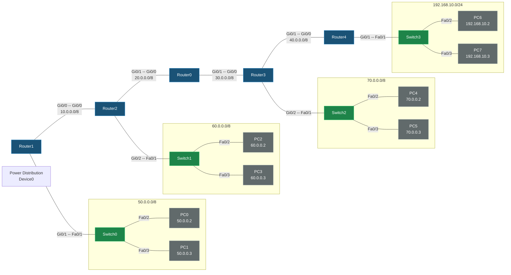

# DHCP Lab (EIGRP Core)

## Topology



## Devices

| Device | Model | Role |
|---|---|---|
| Router1 | 2911 | Backbone, LAN50 (Switch0) |
| Router2 | 2911 | Backbone, LAN60 (Switch1) |
| Router0 | 2911 | Backbone transit (no local LAN) |
| Router3 | 2911 | Backbone, LAN70 (Switch2) |
| Router4 | 2911 | Backbone, LAN10 (Switch3) |
| Switch0–Switch3 | 2960-24TT | L2 access switches, one per LAN |
| PC0, PC1 | PC-PT | 50.0.0.2–3/8, GW 50.0.0.1 |
| PC2, PC3 | PC-PT | 60.0.0.2–3/8, GW 60.0.0.1 |
| PC4, PC5 | PC-PT | 70.0.0.2–3/8, GW 70.0.0.1 |
| PC6, PC7 | PC-PT | 192.168.10.2–3/24, GW 192.168.10.1 |
| Power Distribution Device0 | iot_pdu | Present, unconnected |

## IP Plan

| Link / Subnet | CIDR | Interfaces |
|---|---|---|
| R1 ↔ R2 | 10.0.0.0/8 | R1 Gi0/0 = 10.0.0.1, R2 Gi0/0 = 10.0.0.2 |
| R2 ↔ R0 | 20.0.0.0/8 | R2 Gi0/1 = 20.0.0.1, R0 Gi0/0 = 20.0.0.2 |
| R0 ↔ R3 | 30.0.0.0/8 | R0 Gi0/1 = 30.0.0.1, R3 Gi0/0 = 30.0.0.2 |
| R3 ↔ R4 | 40.0.0.0/8 | R3 Gi0/1 = 40.0.0.1, R4 Gi0/0 = 40.0.0.2 |
| LAN50 (Switch0) | 50.0.0.0/8 | R1 Gi0/1 = 50.0.0.1 |
| LAN60 (Switch1) | 60.0.0.0/8 | R2 Gi0/2 = 60.0.0.1 |
| LAN70 (Switch2) | 70.0.0.0/8 | R3 Gi0/2 = 70.0.0.1 |
| LAN10 (Switch3) | 192.168.10.0/24 | R4 Gi0/1 = 192.168.10.1 |

Backbone chain: **R1 — R2 — R0 — R3 — R4** (linear, R2↔R0↔R3 through the middle), each router also dropping one LAN off to a switch — except Router0, which is pure transit.

## Routing

All five routers run **EIGRP autonomous-system 10**, advertising their directly-connected networks:

- **Router0**: `network 20.0.0.0`, `network 30.0.0.0`
- **Router1**: `network 10.0.0.0`, `network 50.0.0.0`
- **Router2**: `network 10.0.0.0`, `network 20.0.0.0`, `network 60.0.0.0`
- **Router3**: `network 30.0.0.0`, `network 40.0.0.0`, `network 70.0.0.0`
- **Router4**: `network 40.0.0.0`, `network 192.168.10.0`

This gives every PC subnet (50/60/70/8 and 192.168.10.0/24) full reachability to every other via EIGRP-learned routes across the backbone.

## Configs

### Router0
```
hostname Router0
interface GigabitEthernet0/0
 ip address 20.0.0.2 255.0.0.0
interface GigabitEthernet0/1
 ip address 30.0.0.1 255.0.0.0
interface GigabitEthernet0/2
 no ip address
 shutdown
router eigrp 10
 network 20.0.0.0
 network 30.0.0.0
```

### Router1
```
hostname Router1
interface GigabitEthernet0/0
 ip address 10.0.0.1 255.0.0.0
interface GigabitEthernet0/1
 ip address 50.0.0.1 255.0.0.0
interface GigabitEthernet0/2
 no ip address
 shutdown
router eigrp 10
 network 10.0.0.0
 network 50.0.0.0
```

### Router2
```
hostname Router2
interface GigabitEthernet0/0
 ip address 10.0.0.2 255.0.0.0
interface GigabitEthernet0/1
 ip address 20.0.0.1 255.0.0.0
interface GigabitEthernet0/2
 ip address 60.0.0.1 255.0.0.0
router eigrp 10
 network 10.0.0.0
 network 20.0.0.0
 network 60.0.0.0
```

### Router3
```
hostname Router3
interface GigabitEthernet0/0
 ip address 30.0.0.2 255.0.0.0
interface GigabitEthernet0/1
 ip address 40.0.0.1 255.0.0.0
interface GigabitEthernet0/2
 ip address 70.0.0.1 255.0.0.0
router eigrp 10
 network 30.0.0.0
 network 40.0.0.0
 network 70.0.0.0
```

### Router4
```
hostname Router4
interface GigabitEthernet0/0
 ip address 40.0.0.2 255.0.0.0
interface GigabitEthernet0/1
 ip address 192.168.10.1 255.255.255.0
interface GigabitEthernet0/2
 no ip address
 shutdown
router eigrp 10
 network 40.0.0.0
 network 192.168.10.0
```

### Switches (Switch0–Switch3)
```
! Identical role on each: Fa0/1 = uplink to router, Fa0/2 & Fa0/3 = PC access ports
! Default VLAN 1, no L3 config, spanning-tree pvst
```

### PCs
```
PC0: 50.0.0.2       / 255.0.0.0       / GW 50.0.0.1
PC1: 50.0.0.3       / 255.0.0.0       / GW 50.0.0.1
PC2: 60.0.0.2       / 255.0.0.0       / GW 60.0.0.1
PC3: 60.0.0.3       / 255.0.0.0       / GW 60.0.0.1
PC4: 70.0.0.2       / 255.0.0.0       / GW 70.0.0.1
PC5: 70.0.0.3       / 255.0.0.0       / GW 70.0.0.1
PC6: 192.168.10.2   / 255.255.255.0   / GW 192.168.10.1
PC7: 192.168.10.3   / 255.255.255.0   / GW 192.168.10.1
```


## 📋 Project Overview
This repository contains an advanced Cisco Packet Tracer network implementation featuring multiple interconnected Cisco 2911 routers, switch-based local access networks, and centralized IP configuration management[cite: 6, 8, 12].

---

## 🏗️ Network Topology & Design
* **Topology Type:** Multi-Router Enterprise Network[cite: 6, 8]
* **Core Devices:** 
  * **Routers:** Cisco 2911 Routers interlinked via GigabitEthernet interfaces[cite: 6, 8]
  * **Switches:** Cisco 2960 Access Switches deployed across multiple subnets[cite: 6, 8]
  * **End Devices:** Multiple PCs configured across departments[cite: 6, 8]
* **Subnet Architecture:** Includes segmented networks such as `50.0.0.0`, `60.0.0.0`, `70.0.0.0`, and `192.168.10.0`[cite: 6, 8].

---

## ⚙️ Implemented Configurations
* **Dynamic / Static Routing:** Configured pathways for cross-network communication between separate router domains[cite: 6, 8].
* **DHCP Services & Helper Address:** Configured `ip helper-address` on router interfaces to forward DHCP broadcast requests across network segments to a central server[cite: 6].
* **IP Exclusion Ranges:** Implemented DHCP address pooling with specific exclusion ranges to avoid IP conflicts[cite: 6].

---

## 📂 Repository Structure
```text
├── DHCP.pkt                 # Cisco Packet Tracer topology file[cite: 12]
├── DHCP Routing.docx        # Detailed lab report and documentation
└── README.md                # Project documentation
